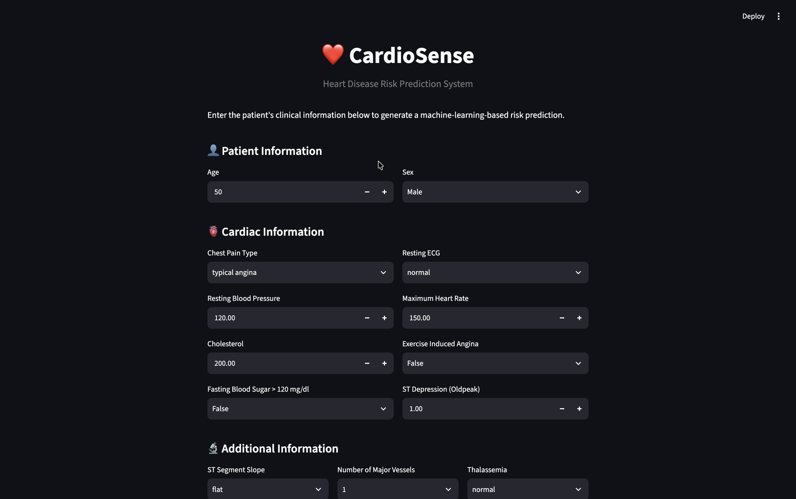
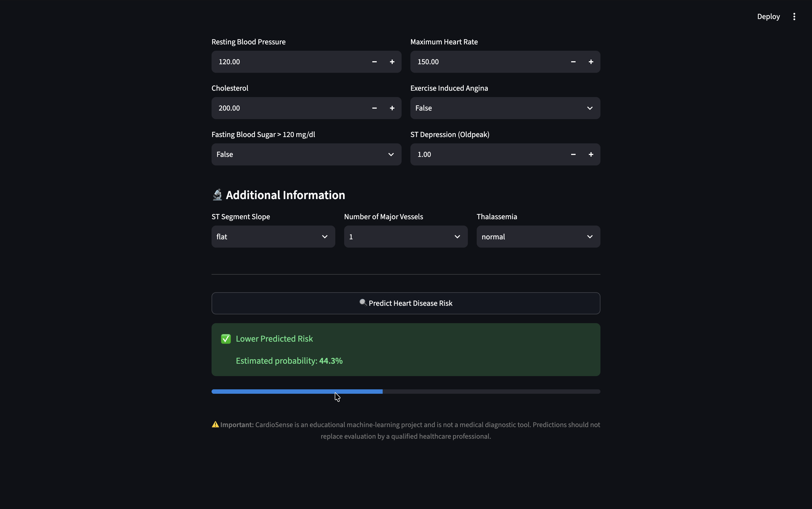

# ❤️ CardioSense

### Heart Disease Risk Prediction System

CardioSense is an end-to-end machine learning project that predicts the risk of heart disease from clinical patient information.

The project covers the complete ML workflow: exploratory data analysis, preprocessing, feature engineering, model comparison, hyperparameter tuning, evaluation, model serialization, and deployment through an interactive Streamlit dashboard.

> ⚠️ **Disclaimer:** CardioSense is an educational machine-learning project and is not a medical diagnostic tool. It should not be used to make clinical decisions or replace professional medical advice.

---

## 📸 Dashboard

### Patient Input Dashboard



### Prediction Result



---

## Features

- Exploratory Data Analysis (EDA)
- Missing-value analysis
- Median imputation for numerical features
- Most-frequent imputation for categorical features
- Missing-value indicators
- One-hot encoding
- Numerical feature scaling
- Logistic Regression and Random Forest comparison
- Hyperparameter tuning with GridSearchCV
- Stratified 5-fold cross-validation
- ROC-AUC and Precision-Recall evaluation
- Confusion matrix analysis
- Probability-based predictions
- Complete preprocessing + model pipeline saved with Joblib
- Interactive Streamlit dashboard

---

## 📊 Dataset

The project uses the **UCI Heart Disease dataset**.

The dataset contains 920 patient records and 16 original columns.

Important clinical features include:

- Age
- Sex
- Chest pain type
- Resting blood pressure
- Cholesterol
- Fasting blood sugar
- Resting ECG
- Maximum heart rate
- Exercise-induced angina
- ST depression
- ST segment slope
- Number of major vessels
- Thalassemia

### Target Transformation

The original `num` target contains values from `0` to `4`.

For this project, it was converted into a binary classification target:

```text
0 → No heart disease
1–4 → Heart disease
```

The identifier column (`id`) and dataset source column (`dataset`) were excluded from the model.

---

## 🧠 Machine Learning Pipeline

```text
Raw Clinical Data
        ↓
Train/Test Split
        ↓
Missing Value Handling
        ↓
Missing Indicators
        ↓
One-Hot Encoding
        ↓
Standard Scaling
        ↓
Machine Learning Model
        ↓
Probability Prediction
        ↓
Streamlit Dashboard
```

All preprocessing steps are included inside the Scikit-learn pipeline. This ensures that preprocessing is learned only from the training data and can be consistently applied to new patient inputs.

---

## 🔧 Preprocessing

### Numerical Features

Numerical missing values are handled using median imputation.

Missing-value indicators are also added so the model can capture information associated with whether a value was missing.

Numerical features are standardized using `StandardScaler`.

### Categorical Features

Categorical missing values are filled using the most frequent category.

Categorical variables are then transformed using `OneHotEncoder`.

Unknown categories are handled safely using:

```python
handle_unknown="ignore"
```

---

## 🤖 Models

Two classification algorithms were evaluated.

### Logistic Regression

Logistic Regression was used as the main interpretable classification model.

The regularization parameter `C` was tuned using GridSearchCV:

```text
C = [0.01, 0.1, 1, 10, 100]
```

### Random Forest

A Random Forest classifier with 300 trees was also trained and evaluated.

---

## 📈 Model Evaluation

The models were evaluated using:

- Accuracy
- Precision
- Recall
- F1 Score
- ROC-AUC
- Confusion Matrix
- Stratified 5-fold Cross-Validation

### Tuned Logistic Regression — Test Set

| Metric    |  Score |
| --------- | -----: |
| Accuracy  | 84.24% |
| Precision | 82.88% |
| Recall    | 90.20% |
| F1 Score  | 86.38% |
| ROC-AUC   | 91.39% |

### Tuned Logistic Regression — 5-Fold Cross-Validation

| Metric    |   Mean |
| --------- | -----: |
| Accuracy  | 82.83% |
| Precision | 84.58% |
| Recall    | 84.49% |
| F1 Score  | 84.43% |
| ROC-AUC   | 90.25% |

The cross-validation results are used as a more robust estimate of model generalization than relying only on one train/test split.

---

## 🔍 Why Recall Matters

In a heart disease risk prediction setting, false negatives are important because they represent cases where disease is present but the model predicts lower risk.

Therefore, CardioSense evaluates recall together with precision, F1 score, ROC-AUC, and the confusion matrix instead of relying only on accuracy.

---

## 🌐 Streamlit Application

The trained pipeline is saved as:

```text
models/cardiosense_model.pkl
```

The Streamlit application accepts the same clinical features used during training and produces:

- Predicted risk class
- Estimated probability of heart disease
- Visual probability indicator

Run the application with:

```bash
streamlit run app.py
```

---

## 📁 Project Structure

```text
CardioSense/
│
├── data/
│   └── heart_disease_uci.csv
│
├── models/
│   └── cardiosense_model.pkl
│
├── notebooks/
│   └── 01_eda_and_modeling.ipynb
│
├── screenshots/
│   ├── cardiosense_dashboard.png
│   └── cardiosense_prediction.png
│
├── app.py
├── requirements.txt
├── README.md
└── .gitignore
```

---

## ⚙️ Installation

Clone the repository:

```bash
git clone https://github.com/YOUR_USERNAME/CardioSense.git
```

Move into the project:

```bash
cd CardioSense
```

Create a virtual environment:

```bash
python -m venv .venv
```

Activate it on macOS/Linux:

```bash
source .venv/bin/activate
```

Install dependencies:

```bash
pip install -r requirements.txt
```

---

## ▶️ Run the Application

```bash
streamlit run app.py
```

The Streamlit dashboard will open in your browser.

---

## 🛠️ Technologies Used

- **Python**
- **Pandas**
- **NumPy**
- **Scikit-learn**
- **Joblib**
- **Streamlit**
- **Matplotlib**
- **Seaborn**
- **Jupyter Notebook**

---

## Future Improvements

- SHAP-based model explainability
- Probability calibration
- External validation on an independent dataset
- More extensive hyperparameter optimization
- Model monitoring
- Dockerization
- Cloud deployment
- Improved UI/UX
- Model comparison with gradient boosting algorithms

---

## ⚠️ Disclaimer

CardioSense is intended for educational and research purposes only.

It does not provide medical diagnosis, treatment recommendations, or clinical decisions. Any health-related decision should be made with a qualified healthcare professional.

---

## 👨‍💻 Author

**Krishna Arun Magotra**

B.Tech Information Technology
National Institute of Technology, Srinagar
